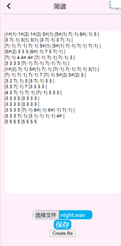
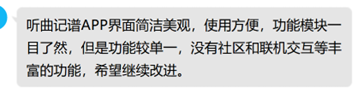
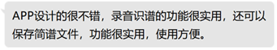

# 用户使用截图

# 用户反馈截图

反馈1

反馈2

# 总结

在整合用户反馈后，我们进行了规整，我们的app主要有以下优点： 

1. 界面简洁，UI设计美观。 

2. 功能实用，使用方便，录音和选择上传文件的功能齐全。

3. 体量小，不占内存，运行快速，体验很好。

 

同时我们也通过用户使用后的反馈发现了我们的app需要改进和完善的地方：后续可以尝试加入社区模块，用户可以在社区讨论和分享内容，形成一定的用户群体和营造良好的社区氛围以促进我们的app有更好的发展前景。此外软件的ui设计还可以继续完善。

根据以上用户的反馈，我们对界面进行了优化调整。并考虑在之后的版本上线社交功能。