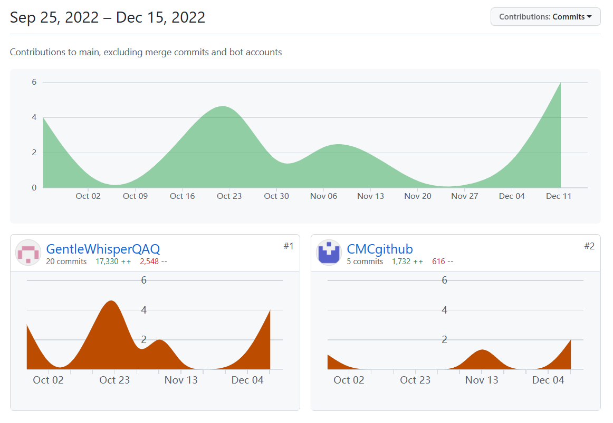

# 系统实现

## 运行环境

计算机环境：使用的是windows10进行的开发。处理器：Intel（R）Core（TM）i7-10750H @ 2.20Ghz 2.21Ghz 内存（RAM）：16.0GB（15.9GB可用）

系统类型：64位操作系统，基于x64的处理器。

编程语言：JavaScript

程序框架：前端：html+css+js，后端：nodejs 打包工具：Cordova

IDE：vscode

实现语言：Html5+CSS+JavaScript+Cordova打包

## 代码签入记录

## 关键函数说明

网页应用的每个html均可视为独立的模块。本项目主要有 6个不同页面，即 6 个模块组成。其中，index页面为软件主界面，实现软件跳转到其他模块的按钮入口；collection页面为简谱收藏模块，实现用户收藏简谱集的展示；histRecord页面为历史记录模块，实现用户曾经上传或录制的音频简谱的保存和展示；display页面为简谱文件显示模块，用于显示某一简谱文件的详细内容；mic.html为录音模块，实现用户通过录音上传音频文件进行简谱解析的功能；analysis.html为用户上传音频文件并进行简谱解析的模块。

 

**4.2.1 index模块**

功能：作为软件起始页，提供其他功能模块的跳转按钮，并能够根据用户的点击情况实现界面的跳转。

实现：顶部用两个div封装的a标签实现收藏和历史记录的模块跳转，中间显示软件ui设计的logo，底部用两个按钮加事件的方式实现上传文件和录音的模块跳转。有关html界面跳转的函数都在Return.js中实现，需要引用相关函数的html文件通过script标签引用即可。给“本地上传”和“录音”两个按钮分别加onlick事件调用JieXi()和LuYin()两个函数即可实现用户点击是界面跳转。

 

**4.2.2 collection****和histRecord****模块**

功能：显示用户的收藏简谱和历史记录，可以通过右上角的图标实现两页面之间的切换。

实现：Web Storage API 提供了存储机制，通过该机制，浏览器可以安全地存储键值对，根据该API提供的特定域名下的本地存储的功能，调用localStorage对象的方法存储对应简谱文件和其文件路径（URL）的键值对。

 

**4.2.3 display模块**

功能：在页面相应位置显示简谱文件的具体内容。

实现：通过简谱文件和其对应文件路径显示在页面地内容区，函数display(filename,url)接收指定音频文件，并将其内容显示在html页面地对应区域。

 

**4.2.4 mic模块**

1.addEventListener函数 

入口参数：

①type表示监听事件类型的大小写敏感的字符串

②listener表示当所监听的事件类型触发时，会接收到一个事件通知对象。listener 必须是一个实现了 EventListener 接口的对象，或者是一个函数。

返回值：无

功能：给录音按钮添加点击监听事件

实现：根据录音状态来确定点击事件发生后进行的操作

 

2.createMediaStreamSource函数

入口参数：一个MediaStream 对象

返回值：MediaStreamAudioSourceNode对象

功能：创建一个新的MediaStreamAudioSourceNode 对象，然后来自 MediaStream 的音频就可以被播放和操作。

实现：获取录音权限成功得到媒体流 MediaStream 并实例一个MediaRecorder对象

 

3.controlMediaRecorder

功能：此函数在点击事件后触发，用于判断录音状态，控制录音过程

实现：判断当前MediaRecorder状态是否在休息，若在休息就将之前录音清空，开始录音并请求帧；若正在工作则暂停录音，返回解析结果。

 

4.MediaStreamSourceNode.connect

入口参数：需要连接的 AudioNode

返回值：返回入口参数所表示的 AudioNode 对象的引用

功能：将一个节点的输出连接到一个指定目标， 

实现：这里将我们分析时候要用到的MediaStreamSourceNode结点和分析时候用到的analyser结点连接起来，便于之后的解析。

 

**4.2.5 audioFile模块**

1.XMLHttpRequest.open

入口参数：

①要使用的 HTTP 方法

②发送请求的 URL

返回值：一个XMLHttpRequest对象

功能：初始化一个新的读入文件的请求

实现：用GET方法打开对应的url文件

 

2.XMLHttpRequest.response

入口参数：无

返回值：请求数据

功能：对相应请求数据类型做出一个响应，保存到返回值中

实现：先设置responseType类型为arraybuffer类型，调用该函数，返回值存入audioData数组中。

 

3.AudioContext.decodeAudioData

入口参数：

①将会被解码的音频数据

②成功解码后被调用的回调函数。

③可选的错误回调函数。

返回值：一个解码后的对象

功能：将一个音频数据进行解码，解码后返回AudioBuffer对象

实现： 将XMLHttpRequest.response得到的音频文件数据作为被解码的音频数据读入，成功解码后会返回AudioBuffer对象，并且调用playFun函数，对AudioBuffer的各个属性进行初始化。

 

4.AudioBufferSourceNode.connect 

同MediaStreamSourceNode.connect，不再赘述。

 

**4.2.6 analysis模块**

1.requestAnimationFrame

入口参数：一个希望执行的回调函数

返回值：请求 ID，是回调列表中唯一的标识

功能：更新动画，并且在下次重绘之前调用指定的回调函数更新动画

实现：将更新帧的动画放入回调函数中，每次回调函数中会再次调用requestAnimationFrame方法，直到解析完成，flag标识变为1为止，退出帧的递归。

 

2.freqToNote

入口参数：存放音频数据的数组

返回值：生成的简谱数据

功能：将音频的时域数据变换为频域数据，根据频域数据来找对应音符的音高，最终返回生成带有简谱数据的数组。

实现：首先调用getByteFrequencyData方法，将音频频域数据复制到传入的Uint8Array数组，调用getMaxRange函数对该数组进行最大振幅频率的获取，该最大振幅频率是由频率步长和各个区间内频率强度决定的，之后将该最大振幅频率和88音音高标准频率数组传入binarySearch函数，二分查找得到对应音符数组下标，之后用哈希表查找的方式在keyList中找到对应的音高，写入简谱数组并以简谱形式传入前端进行展示。（此处主要说明调用函数的关系，具体实现方法可见3.4关键算法设计）

# 系统测试

见软件工程项目报告。