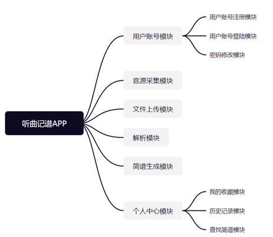

# 系统结构

本系统从功能上可以分解为多个模块，依靠模块自身功能的实现以及模块之间的协同合作达到预期的效果。具体到各个模块的功能，可以将其分为：音源采集模块、文件上传模块、解析模块、简谱生成模块、个人中心模块、用户账号模块。

1.音源采集模块。主要功能：通过麦克风采集音频，传入解析部分进行音源的乐谱解析。解析部分完成解析后返回解析结果，随着录音过程的进行，数字简谱展现在屏幕前。录音结束后可以试听或者删除。

2.文件上传模块。主要功能：上传本地音频文件进行解析，支持MP3、wav格式在内的多种格式音源，将音源文件处理成音频数组传入解析部分。解析部分完成解析后返回解析结果，解析结果会同音乐播放实时显示。

3.解析模块。主要功能：对传入的音频文件或采集到的音频进行解析。接受参数是和音频相关的audioBuffer数组，通过频谱分析方法FFT，得到频率数组，提取频率分量最大的频率为特征值，和标准音频率比较，选择最接近的频率作为解析结果。该模块调用频率和系统帧率有关，可以自行调节。完成对应的解析操作后，对应信息写入finalNoteArray数组中，并向前端传递对应的响应信息。

4.简谱生成模块。主要功能：根据解析结果写简谱。接受的参数为finalNoteArray数组，该数组信息会随解析过程呈现在前端页面上，同时解析完成后可以选择对解析结果进行保存，保存的结果是解析完成后的简谱，存格式可以选择 txt/pdf 格式。同时简谱信息传入后台，后台数据进行更新，并更新历史记录部分。生成的简谱可以选择加入收藏或删除。若选择加入收藏，则在我的收藏中进行数据更新；若选择删除，则在数据库中删除这一条解析数据。

5.个人中心模块主要可以分为我的收藏模块、历史记录模块、查找简谱模块等子模块。

（1）我的收藏模块。主要功能：保存个人收藏的简谱。从前端获取数据，通过数据 url 获取相应数据文件，并且返回对应渲染页面。对于已经收藏的简谱，可以选择取消收藏，则在相关的收藏数据后台更新删除后的收藏库。

（2）历史记录模块。主要功能：记录近期解析过的音频简谱。在数据库中查找一定时间范围内的简谱，将其记录呈现出来。

（3）查找简谱模块。主要功能：查找在记录中的简谱。根据每个简谱解析完成后的命名，调用底层数据查找的接口，快速定位某一个想要的简谱。

6.用户账号模块包括用户账号注册、用户账号登陆、密码修改等子模块。

（1）用户账号注册模块。主要功能：实现用户注册页面的展示，用户创建账号的数据提交与收取，数据检验和数据入库，以及前端反馈等。对应的接口为register函数，可接受前端传入的post数据，进行数据结构检错后调用数据库进行用户数据库的更新，并向前端传递对应的响应信息。

（2）用户账号登陆模块。主要功能：用户登录页面的展示，用户登录的数据提交与收取，数据检验和数据入库，以及前端反馈等。 对应的接口为login函数，可接受前端传入的post数据，进行数据结构检错后调用数据库进行数据的查找，并向前端传递对应的响应信息。

（3）密码修改模块。主要功能：用户密码修改，后台数据库密码更新，前端反馈等。对应的接口为modify函数，可接受前端传入的post数据，进行数据结构修正后进行数据的更新，并向前端传递对应的响应信息。

# 系统结构图

# 系统类图

系统设计类主要分为各个模块划分，实体类有用户类、简谱类、游客类，方法类有录音类、文件上传类、解析类。

其中用户类继承游客类，同时用户类和游客类在访问简谱类的时候会有权限的差异。而用户类和游客类都可以进行文件上传与录音，同时也可以进行音频的简谱解析，生成简谱，不同地，游客类仅仅对于简谱有查看的权限，而用户不仅能查看生成的简谱，还可以对简谱进行收藏等管理操作。另外，进行社区访问以及互动的权限也只存在用户类中。

录音类和文件上传类主要负责音频的采样，以及采样后解码后传给解析类。解析类则负责音频的解析，解析完成后将结果在简谱类中更新。

# 关键数据结构定义

## 系统功能数据结构

1.音高相关的数据结构

（1）noteArr

  一个浮点数数组，用于存放钢琴 88 音对应的频率值。

（2）keyList

一个字符串数组，用于存放钢琴 88 音对应的简谱表示。

（3）finalNoteArray

一个字符串数组，用于存放解析过程中生成的简谱，数组的每个元素都是音乐某一帧的音高，最终解析完成后的简谱结果保留在该数组中。

 

2.音源采集模块的数据结构

（1）audioStream

该数据结构记录当前的录音流，其数据项包括：

布尔型变量status，用于记录录音状态；

数组streams，用于存储录音流；

对象blob，用于存储最终生成的录音blob。

​    相关代码定义如下：

const audioStream = {

  status: false, // 录音状态

  streams: [], // 用于存储录音stream

  blob: null, // stream转换成的blob

}

 

（2）MediaRecorder

  MediaRecorder是一个web api接口类，其中定义了有关媒体流采集时的参数，其中：audioBitsPerSecond 用于记录音频采集每秒的比特率，status 表示采集状态。代码定义如下：

const MediaRecorder={

  audioBitsPerSecond: 128000, //音频采集每秒的比特率

  state: inactive, // inactive 休息,recording 录音中,paused 暂停

}

 

3.文件上传模块数据结构。

（1）AudioBufferSourceNode

主要用于存放音频文件的解码内容，将音频转换为计算机能够理解的语言，其中相关的数据结构有：

数组buffer，用于存放声音文件的来源，记录声音数据；

布尔型变量loop，用于标志是否循环播放声音文件。

代码定义如下：

const AudioBufferSourceNode={

  buffer: null, //存放使用 AudioBuffer 作为声音文件的来源

  loop: false //是否循环

}

 

4.解析模块数据结构。

（1）AnalyserNode

主要用于定义分析音频数据相关算法需要采用的参数值，其中相关的数据结构有：

整型变量fftSize，表示傅里叶变换过程中的傅里叶窗口大小，即频率轴的频率间隔或分辨率；

整型变量frequencyBinCount，表示采样数目，即音频信息数组大小，采样数目决定了两个频率之间的最小差；

浮点型变量smoothingTimeConstant，表示平均常数，在0-1之间，用于设置时间间隔取样的圆滑性。

const AnalyserNode={

  fftSize : 4096, //傅里叶窗口大小

  frequencyBinCount: 2048, //采样数，也就是音频信息数组大小

  smoothingTimeConstant: 1 //分析帧的平均常数，在0-1之间

}

## 用户管理数据结构

用户管理主要记录用户信息和简谱信息，处理是和某个用户相关的数据，包括用户的注册，用户对个人简谱中心的访问等。

1.用户信息主要数据：用户的注册和登录，操作简谱。

Uid，用户ID，主码，长整型数据，用来唯一标识一名用户；

Uip，用户IP，字符串数据，用来表示用户的所在地；

Uname，用户名，字符串数据，用于用户登录；

Upassword，用户密码，字符串数据，用于用户登录；

Unickname，用户昵称，字符串数据，作为用户在系统中的自起名；

Umail，用户邮箱，字符串数据，用来表示用户邮箱；

Uphoto，用户头像，字符串数据，用来记录用户头像图片关联的url；

Uregister_time，注册时间，日期数据，用来表示用户注册时间；

Ubirthday，用户生日，日期数据，用于记录用户生日；

Uage，用户年龄，整型数据，用于记录用户年龄；

Uphone，用户手机号，字符串数据，用于记录用户联系方式。

 

2.简谱信息主要数据：用户可以在系统中添加、删除、收藏简谱。

Nid，简谱ID，主码，长整型数据，用来唯一标识一个简谱；

Nuid，拥有简谱的用户ID，外码，长整型数据，用来表示拥有该简谱的用户；

Ntitle，简谱标题名，字符串数据，用于表示简谱的名称；

Ncontent，简谱内容，长字符串数组数据，用于记录简谱内容；

Nviews，简谱浏览量，整型数据，用于记录用户浏览简谱次数；

Ndate，简谱生成时间，日期数据，用于记录简谱生成时间；

Nlike，简谱收藏，布尔型数据，用于表示用户是否将该简谱加入个人收藏，true表示加入，false表示未加入。

## 数据关联结构设计

前后端数据关联，分页面介绍如下

register.html页面的前后端数据关联 前端传入Uname、Upassword和Unickname到用户数据库Uname、Upassword和Unickname中。

login.html页面的前后端数据关联 前端传入的Uname和Upassword和用户数据库的数据进行匹配。

Index.html页面的前后端数据关联 后端读取出来的用户信息，读出所有课程的Unickname，Umail，Uphoto，Ubirthday等用户信息，然后将相关数据发给前端界面进行渲染展示，然后对于没有登录的用户，其历史记录和收藏界面的简谱文件内容显示为空，对于登录的用户，在历史记录和收藏界面显示后端数据库中的Ntitle和Ncontent等数据。

个人信息页面的前后端数据关联 用户登录后，使用当前会话的Uid从数据库中获取一条用户的信息，前端的name对应后端数据库信息中的Nickname，前端获取后端的Uphoto并渲染用户头像。

收藏和历史记录页面的前端将当前用户的Uid传入后端，后端查找数据库中所有简谱Nuid与当前Uid相等的简谱信息发给前端，如果Nlike = true,前端将该简谱划分到收藏界面显示，同时不管Nlike 的值是否为TRUE，都将其划分到历史记录中，将Nviews、Ndate、Nlike等信息渲染并显示。

## 数据关联结构图

# 关键算法设计流程图

## 音频采集模块

## 文件上传模块

## 解析模块

总流程图

频率到简谱音高的解析转换图

## 简谱生成模块

## 用户账号模块

## 个人中心模块

个人中心模块主要实现收藏简谱和查找简谱，以及对历史数据的记录。

（1）收藏简谱

 收藏简谱功能包括加入收藏与取消收藏，其中加入收藏操作执行时，关联用户ID和当前简谱ID，将当前简谱表中的简谱收藏数据项置为true，并且将数据库中新信息传递给前端页面，前端根据数据库内容对页面重新更新。执行取消收藏操作时，把当前简谱表中简谱收藏数据项置为false，并交给前端同步更新。

（2）查找简谱

查找简谱接受输入框中输入的信息，遍历简谱表中所有简谱，将Ntitle表项内容提取出来，同输入的信息一起采用KMP算法进行字符串匹配，如果能够匹配上，说明查找的简谱可能就是当前简谱表中遍历到的简谱，将该简谱信息提取出来传入前端，显示到前端界面上。

（3）历史记录

查找Ndate在一定范围内的简谱，将这些简谱传给前端显示，同时如果Ndate大于某一时间范围同时Nlike字段值为false，则将这条简谱数据从简谱表中移除。