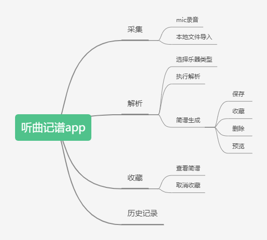

# 项目选题

对于本次软件工程项目的选题，在经过小组的讨论和头脑风暴之后，我们决定开发一款听曲记谱的APP。对于很多音乐爱好者或是从事音乐相关工作的人来说，简谱的来源途径非常有限：书本形式的简谱所能记录的曲目有限，而且无法随着时间的推移不断更新；而在网络上查找有关曲目的简谱一方面需要知道曲目的名称，另一方面，网络查找的结果良莠不齐，会耗费大量的时间。我们也注意到也有一些专业音乐工具提供了曲谱转换的功能，但是这些专业软件有一定的学习成本，使用操作过于复杂，同样不利于广大音乐爱好者的使用。 经过讨论我们小组一致认为，目前市面上缺少一款便于广大音乐爱好者和从业者使用的简单易用的曲谱转换工具。

# 思维导图

通过思维导图的任务划分，我们可以将总体的项目目标分解为如下的几个子目标。

1、实现音频的采集功能，音频的具体来源可以分为两种，一种是现场通过mic录制音频，另一种方式是在本地文件中导入音频。用户在使用时可以根据自身的需求自行选择。

2、实现音频的解析。具体的解析过程为，用户首先需要选择乐器的类型，之后开始解析音频文件，解析完成之后的结果以简谱的形式输出，对于解析后简谱，用户可以保存相关简谱，也可以收藏，便于下次使用。

3、实现简谱的收藏功能。用户在收藏简谱后，可以在软件内查看所有已收藏的简谱，同时用户也可以在其中取消收藏。

4、实现历史记录功能，和收藏功能相似，用户既可以查看历史解析记录，也可以对历史记录进行删除。