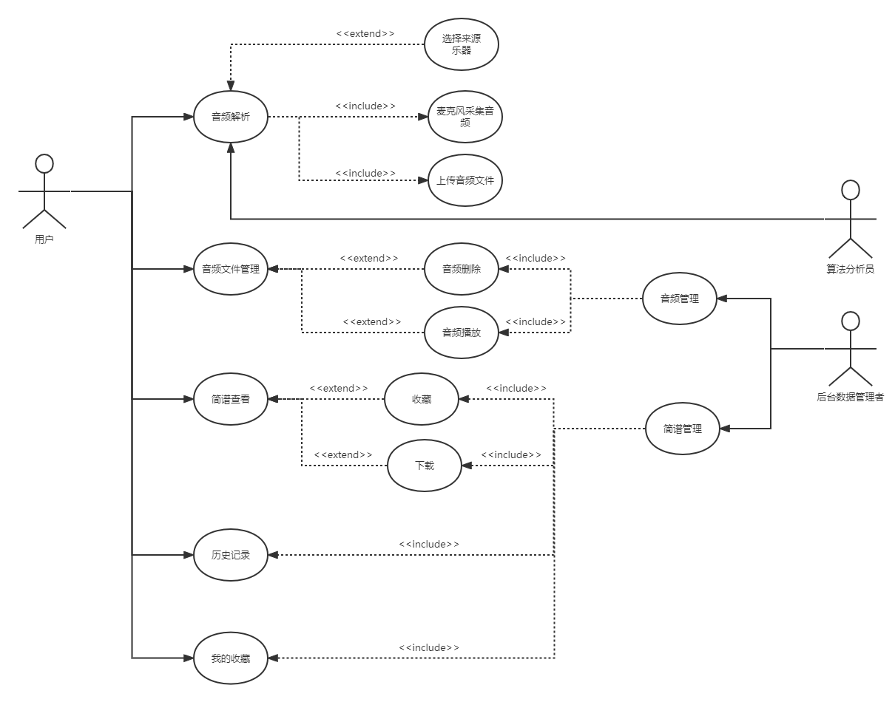
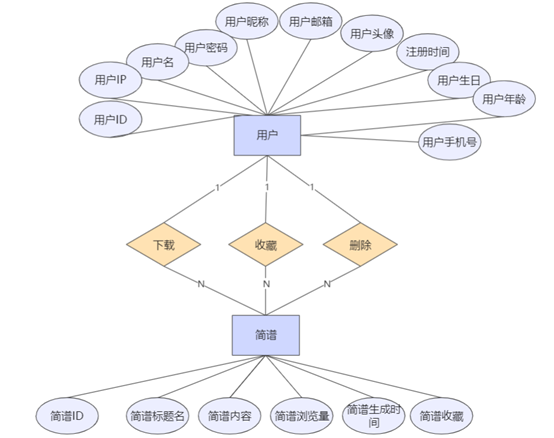
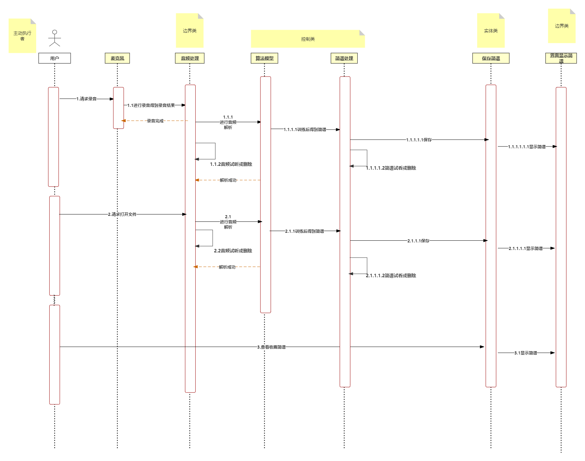

# 需求分析概述

针对不同的用户群体，我们做出了以下合理需求分析：

1、对于掌握一定音乐知识的爱好者，在演奏准备过程中需要得到很多简谱以供演奏，曲谱转换APP就可以通过现场采集音频或者是读取本地文件来实现音频到曲谱的快速转换。在得到不同种类的曲谱之后，演奏者可以根据偏好进行收藏添加，APP也会记录解析历史。这样在下一次需要某个曲谱的时候，用户就可以快速地在APP内找到记录。

2、对于正在学习音乐知识的练习生来说，他们练习的曲目比较固定，在获取曲谱以供演奏的需求方面弱于前者。但是练习生在练习的过程中希望得知自己的练习是否标准正确，这时就可以使用听曲记谱app通过现场采集音频进行解析，输出后的结果可以供用户比较，从而得知自己的练习效果。

# 产品功能

通过用例场景的需求分析，可以列出如下功能：

1、用户登录：根据用户的id和密码进行登录，新用户需要注册账号。

2、主界面：点击开始按钮即可开始选择文件源进行解析，同时提供其他功能入口按钮。

3、解析：在选择音频源之后，开始解析音频。

4、结果展示：以简谱的形式输出解析结果，提供收藏和保存功能。

5、收藏：点击收藏后，当前解析文件将被加入收藏队列中，用户可以在之后的收藏中进行查看。

6、历史记录：保存近期解析过的所有音频记录。

# 系统用例

用户打开软件，APP首先对其提供登录功能，通过用户输入的用户名和密码进行登录操作。之后进入主页面的展示，通过主界面的功能提示，用户以点击的方式进入相应的功能。主页面提供的功能有：音频解析、音频文件管理、收藏查看、历史查看和简谱查看。

音频解析包含的子功能有：选择来源乐器、麦克风采集音频，上传音频文件。音频文件管理包含的子功能有：音频删除、音频播放。简谱查看包含的子功能有：收藏和下载。历史记录和我的收藏同时提供简谱查看和下载。

# 系统ER图

该系统围绕用户和简谱两类实体。

对于用户这一实体而言，包含用户登录注册、使用过程的有关信息属性， 如用户ID、用户IP、用户名、用户密码、用户昵称、用户邮箱、用户头像、注册时间、用户生日、用户年龄以及用户手机号，用来作为用户账号模块和个人信息模块的信息准备，便于用户授权对应信息，了解当前系统状态。

简谱实体则包含简谱ID、简谱标题名、简谱内容、简谱浏览量、简谱生成时间、简谱收藏等属性，用于简谱对应操作功能的实现。

我们提取出了 3 个用户与简谱间的联系：下载简谱、收藏简谱以及删除简谱。并将相关联系包含到各项功能的实现中。

# 系统顺序图

 对于需要解析音频的用户来说，用户登录后，若选择录音采集音频进行解析，则先跳转至麦克风模块，麦克风录音得到录音结果，同时音频处理模块向麦克风模块返回录音完成结果。跳转至音频处理模块。若选择本地文件解析，则在读出文件后跳转至音频处理模块。在音频处理模块，用户可以对要解析的音频进行确认或者删除，若确认解析，则跳转至算法模型模块交由算法模型进行解析和训练。算法模型在训练后得到的简谱交由简谱处理模块进行处理。同样地，简谱处理模块也支持用户对简谱的试看和删除，若用户确认简谱，则跳转至保存简谱模块。简谱保存后跳至界面显示模块，进行简谱的最终显示。

对于需要直接查看历史记录和我的收藏简谱的用户来说，用户在选择相应功能后直接跳至简谱的保存模块，读出相应的简谱后跳至显示模块进行显示。